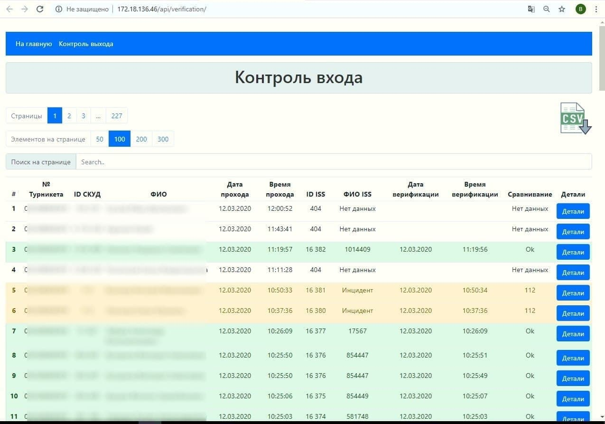

## Description
Prototype of microservices for informing responsible persons about the attendance of an educational institution (College)

The main emphasis was on the control of entry (assessment of the theft of access cards) and exit (absenteeism) of students in the educational institution.

Data collection from ACS turnstiles (databases) and ISS (websocket) face recognition systems in real time with subsequent processing and structuring of information.

## Technologies used:
* Spring Boot 
* Spring MVC
* Spring Data JPA
* Netflix Eureka
* Netflix Zuul
* Flutter
* Websocket with STOMP protocol and without STOMP protocol
* Database PostgreSQL

### Dashboard

### View page

### Security console
